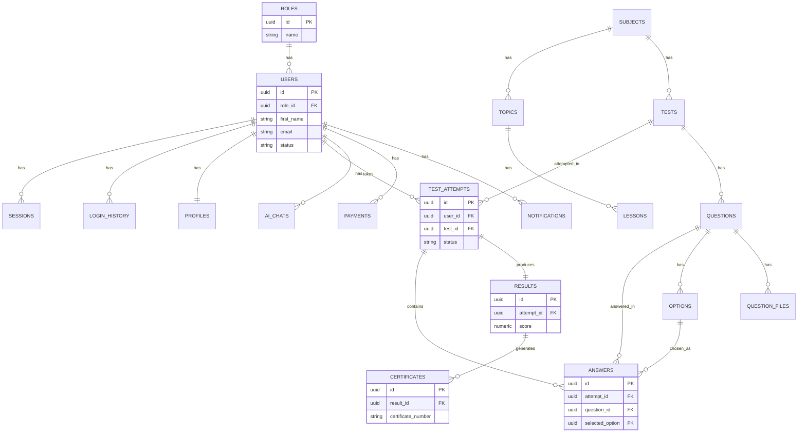

# 04. ER Diagram — BilimUz

Asosiy oqim bo'yicha (Auth → Test Engine → Results → Certificates, Education ierarxiyasi, AI/Payments/Notifications) qisqartirilgan Entity-Relationship diagrammasi. To'liq 52 jadval uchun `database/schema_v1.sql` manbadir — bu yerda faqat asosiy bog'lanishlar ko'rsatilgan.

GitHub avtomatik mermaid'ni render qiladi — quyidagi blok GitHub'da to'g'ridan-to'g'ri diagramma sifatida ko'rinadi.

## Izoh

- Diagramma chat ichida interaktiv widget sifatida ham ko'rsatilgan edi (oldingi javobga qarang) — bu fayl o'sha diagrammaning GitHub'da render bo'ladigan versiyasi.
- `badges`, `plans`, `smtp_settings` kabi mustaqil/konfiguratsiya jadvallari asosiy oqimga bevosita bog'lanmagani uchun bu qisqartirilgan diagrammaga kiritilmadi — ular `database/schema_v1.sql` da to'liq mavjud.
- To'liq ustunlar ro'yxati (barcha 52 jadval) uchun: `docs/03_Database.md` va `database/schema_v1.sql`.
