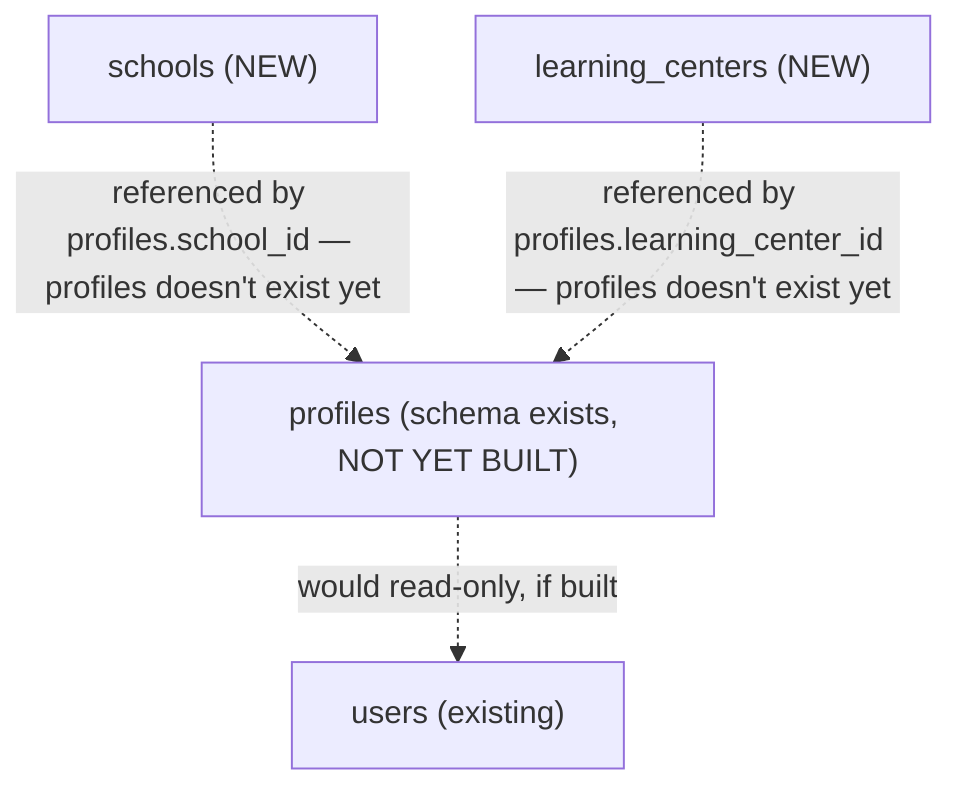

# Sprint 10 — Architecture Design: Schools, Learning Centers

**Status: DESIGN ONLY — no code written, no repository files modified, no ZIP, no git.**

## Architecture Freeze — compliance statement

| Rule | Compliance |
|---|---|
| No new architectural layers | ✅ Same 8-layer pattern: `models, schemas, repository, service, router, dependencies, validators, exceptions, constants, tests/, README.md`. Both modules are simple lookup entities — closest precedent is `grades` (Sprint 5), not any module with a provider abstraction. |
| No parallel implementations | ✅ One model, one repository, one service per entity. Two modules (`schools`, `learning_centers`), not one merged module — matches the schema's own module boundary (Module 5 vs Module 6) and the precedent of keeping `grades`/`topics`/`lessons` as three separate modules despite structural similarity. |
| No temporary or legacy code | ✅ Everything specified is final, production code. |
| Existing architecture exactly | ✅ Router → Service → Repository → Database, unchanged. |
| Work only inside approved module structure | ✅ Two new folders under `app/modules/`. **One real question about touching `users`, flagged explicitly below (Outstanding Decision #1) — not assumed either way.** |
| No placeholders / fake implementations | ✅ N/A this sprint — no provider abstraction, no vendor boundary, nothing to honestly-refuse. Straightforward CRUD, same shape as `grades`. |
| No TODOs except documented future features | ✅ The `profiles` gap (below) is documented as a Future Extension, not a TODO comment in code. |

---

## Critical finding, established before any design choice below

**`profiles` (schema Module 2, part of the same section as `users`) has never been implemented as an ORM model.** Verified: `app/modules/users/models.py` defines only `User`; no `Profile` class exists anywhere in the codebase.

This matters because, per `schema_v2.sql`:
```sql
ALTER TABLE profiles ADD CONSTRAINT fk_profiles_school_id FOREIGN KEY (school_id) REFERENCES schools(id);
ALTER TABLE profiles ADD CONSTRAINT fk_profiles_learning_center_id FOREIGN KEY (learning_center_id) REFERENCES learning_centers(id);
```
The *only* place `school_id`/`learning_center_id` are referenced from is `profiles`, not `users` directly. **There is currently no way for a user to actually "belong to" a school or learning center in the running system**, regardless of what Sprint 10 builds, because the table that would hold that relationship doesn't exist yet.

This is not a blocker for Sprint 10 — `schools`/`learning_centers` are self-contained, valid tables on their own (name, region, status, audit columns) — but it does mean **Sprint 10, as scoped, produces two lookup tables with no consumer yet**, the same honest situation as `ai_recommendations` having no generator until a real AI provider exists. Flagged as **Outstanding Decision #1**.

---

## Module Relationships



**Both new modules have zero dependency on any existing business module** — same independence level as `uploads` (Sprint 8). Neither reads nor writes `users`, `subjects`, or anything else. They are pure, standalone lookup entities this sprint, identical in spirit to `grades` (Sprint 5).

---

## Module A — `app/modules/schools/`

### Module responsibilities
Manage the catalog of physical schools (name, region, district, address, contact phone) that a future `profiles` record could reference. CRUD only — no enrollment, no student-roster logic (that would live in `profiles`, not here).

### Database impact
**No new tables** — `schools` already exists in `schema_v2.sql` (Module 5), already in baseline migration `0001`. **No migration needed.**

### API design

| Method | Path | Purpose | Auth |
|---|---|---|---|
| GET | `/schools` | List/search/filter/paginate | Public |
| GET | `/schools/{id}` | Get one | Public |
| POST | `/schools` | Create | Admin, Super Admin |
| PATCH | `/schools/{id}` | Update | Admin, Super Admin |
| DELETE | `/schools/{id}` | Soft delete | Admin, Super Admin |

Same access shape as `grades`/`subjects` — public read (a school directory is browsable content, not sensitive), Admin-tier write.

### Repository layer
`SchoolRepository`: `get_by_id`, `list` (filter by `region`/`district`/`status`, search on `name`, paginate — same shape as `GradeRepository`), `create`, `update`, `soft_delete`, `commit`. No cross-module reads (nothing to validate against).

### Service layer
`SchoolService`: thin CRUD wrapper, audit-logs `school.created`/`school.updated`/`school.deleted` via the existing `core.audit.log_action()`. No business rule beyond field validation — there's no equivalent of `grades`' "name must be unique" requirement in the schema (`schools.name` has no `UNIQUE` constraint, multiple schools can share a name across different regions, which is realistic — two towns can each have a "1-maktab").

### Dependencies
None on other business modules.

### Validation rules
- `name`: 2–255 chars (schema `VARCHAR(255)`).
- `phone`: reuse the existing Uzbek phone format pattern (`app.modules.auth.validators.validate_uzbek_phone` if a phone is provided) — or a looser check, since a school's landline may not match the mobile `+998XX` mobile-operator pattern. **Flagged as Outstanding Decision #2.**
- `region`/`district`: free text this sprint (schema has no enum/lookup table for regions) — no validation beyond length, since Uzbekistan's region list isn't in `schema_v2.sql` as a controlled vocabulary.

### Security
No secrets, no PII beyond a public contact phone (already public-facing information for a school, comparable to how `subjects`/`tests` are public). Standard RBAC, no deviation.

### Test strategy
Unit tests mirroring `grades`' test suite shape: create/list/get/update/delete, pagination, search/filter, not-found cases, ownership N/A (no user-owned data here — this is Admin-managed reference data, like `grades`/`subjects`). Estimated ~10 tests, matching `grades`' exact count.

---

## Module B — `app/modules/learning_centers/`

### Module responsibilities
Manage the catalog of private learning centers (name, owner name, phone, region). Structurally near-identical to `schools` — kept as a separate module per the schema's own module boundary (Module 6), not merged, matching the `grades`/`topics`/`lessons` precedent of not collapsing similar-shaped entities into one module.

### Database impact
**No new tables** — `learning_centers` already exists (Module 6), already in baseline migration `0001`. **No migration needed.**

### API design

| Method | Path | Purpose | Auth |
|---|---|---|---|
| GET | `/learning-centers` | List/search/filter/paginate | Public |
| GET | `/learning-centers/{id}` | Get one | Public |
| POST | `/learning-centers` | Create | Admin, Super Admin |
| PATCH | `/learning-centers/{id}` | Update | Admin, Super Admin |
| DELETE | `/learning-centers/{id}` | Soft delete | Admin, Super Admin |

### Repository layer
`LearningCenterRepository`: same shape as `SchoolRepository` — `get_by_id`, `list` (filter by `region`/`status`, search on `name`/`owner_name`), `create`, `update`, `soft_delete`, `commit`.

### Service layer
`LearningCenterService`: thin CRUD wrapper, audit-logged the same way as `SchoolService`. No uniqueness constraint on `name` (schema has none), same reasoning as schools — two learning centers in different cities can share a name.

### Dependencies
None on other business modules.

### Validation rules
- `name`: 2–255 chars.
- `owner_name`: optional, 2–255 chars if provided.
- `phone`: same open question as School's phone field — Outstanding Decision #2 applies to both modules identically.

### Security
Same as `schools` — no secrets, standard RBAC.

### Test strategy
Same shape and count as `schools` (~10 tests) — the two modules are structurally close enough that their test suites will look almost identical, which is expected and not a code-quality concern (same reasoning `grades`/`topics`/`lessons` already established: similar CRUD shape, deliberately not abstracted into a shared base to keep each module fully self-contained per module-independence principles).

---

## Estimates

| | Estimate |
|---|---|
| Migrations | **0** — both tables already exist in baseline `0001` |
| Endpoints | **10** (5 per module) |
| Unit tests | **~20** (10 per module) |
| Integration tests | **0** (consistent with every prior sprint — not executable in this environment) |
| Files | **~24** (12 per module, matching `grades`' exact file count) |

---

## Risks

| Risk | Severity |
|---|---|
| **`profiles` doesn't exist — these two tables have no consumer yet.** A user cannot actually be assigned to a school/learning center after this sprint ships. | Medium — not a defect, but a real product-visibility gap worth naming plainly (same category as Sprint 9's "frameworks vs. integrations" risk). |
| **No region controlled-vocabulary** — `region`/`district` are free-text `VARCHAR`, so "Toshkent" and "toshkent" and "Tashkent" could all exist as distinct values with no validation catching the inconsistency. | Low — matches the schema as designed; not something Sprint 10 can fix without a schema change (out of scope). |
| **Phone validation ambiguity** (Outstanding Decision #2) — reusing the strict mobile-only Uzbek pattern could reject legitimate landline numbers. | Low |

---

## Definition of Done
- Same 8-layer pattern, `py_compile`, 0 circular imports, full Swagger (`summary`/`description` on every endpoint — closing the gap flagged in the recent backend audit for older modules, not repeating it here), README/CHANGELOG updates.
- Both Outstanding Decisions below resolved before implementation starts.
- No FK-level integration with `profiles` attempted (it doesn't exist) — `schools`/`learning_centers` ship as standalone, valid, complete lookup tables.

---

## Project Impact Analysis

**Does Sprint 10 introduce architectural changes?** No — same pattern as `grades` exactly.

**Does it increase coupling?** No — both modules have zero dependencies on any existing module, the same independence level as `uploads`.

**Are Schools and Learning Centers independent?** Yes, completely, from each other and from every other module.

**Future extension points?** The `profiles` module itself (Module 2) — building it would be the natural Sprint 11+ candidate, at which point it would read `schools`/`learning_centers` (this sprint's output) read-only for its own FK validation, the same pattern `topics` already uses for `subjects`/`grades`.

**Technical debt risk?** Low. The only "debt" is the acknowledged gap above (no consumer yet) — which is a scope boundary, not a shortcut, and is explicitly the same shape as every previous sprint's honestly-flagged "framework without full integration yet" situation.

---

## Outstanding Decisions — RESOLVED (approved)

1. **`Profile` not built this sprint** — `schools`/`learning_centers` ship standalone, exactly as scoped. User-to-school assignment deferred to a future Profile sprint.
2. **Phone validation — broader institutional format, E.164-style `+998` + 9 digits, no mobile-operator restriction.** Investigated the existing `auth.validators.validate_uzbek_phone` (`^\+998\d{9}$`) — it was already unrestricted by operator prefix, so the same pattern is correct for institutional numbers too. **Not reused directly** — each module defines its own equivalent `validate_phone()` to preserve the zero-cross-module-dependency design already stated above (`schools`/`learning_centers` import nothing from `auth`).
3. **Module naming confirmed**: `learning_centers` (exact schema match).

Implementation proceeds on this basis — scope unchanged from the original design above.

