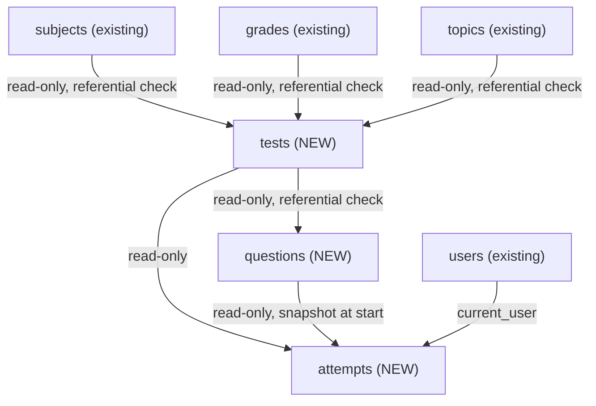
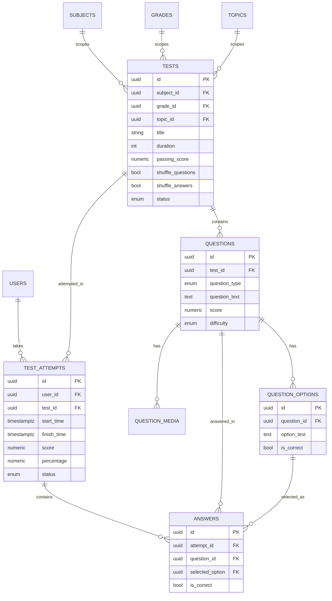
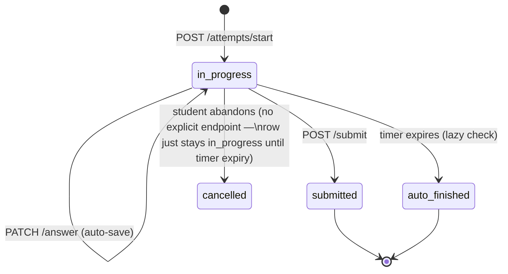

# Sprint 6 — Test Engine: Architecture Document

**Status: DESIGN ONLY — no code written.** This document is for review before implementation begins, per the sprint's explicit request.

---

## 1. Overall Architecture

Test Engine follows the exact same layered pattern as every existing module — no exceptions, no new pattern introduced:

```
Router → Service → Repository → Database
```

Three new modules, matching the natural seams in the data (a Test's *definition*, a Question's *content*, and the *stateful act of taking* a test are different concerns with different lifecycles and different access patterns):

| Module | Owns | Why grouped this way |
|---|---|---|
| `app/modules/tests/` | `tests` table | Test metadata — created once, read often, rarely changes shape after publishing |
| `app/modules/questions/` | `questions`, `question_options`, `question_media` | Three tables, one cohesive concern — a question without options/media is incomplete, exactly the reasoning already used for `permissions` (`permissions` + `role_permissions` in one module). `repository.py` and `service.py` will each contain multiple classes, same pattern. |
| `app/modules/attempts/` | `test_attempts`, `answers` | The actual test-taking engine — timer, randomization, scoring, resume. Deliberately separate from `questions` because its lifecycle (start → in-progress → submitted) and its access pattern (one student, one attempt, sequential) are completely different from authoring content. |

This mirrors the precedent already set: `permissions` owns 2 tables in 1 module; `topics`/`lessons` read other modules' repositories read-only for referential checks. Nothing new is invented here — Test Engine is more tables, not a new pattern.

**Explicit commitments (per this sprint's instructions):**
- No `-v2` endpoints, no parallel implementation of anything that already exists.
- No temporary/placeholder logic — every endpoint shipped is real.
- One database, no schema drift — see Section 3 for the one open question about whether a migration is needed.

---

## 2. Module Relationships



All arrows are **one-directional reads** — `tests` never imports from `attempts`, `subjects` never imports from `tests`. This is the same rule every module has followed since `topics`/`lessons`: a module may read another module's repository for validation, never the reverse, and never a write.

---

## 3. Database Relationships

All six tables already exist in `database/schema/schema_v2.sql` (Modules 11–15) and are already wrapped in the baseline Alembic migration `0001_initial_schema.py` — **no new tables needed**, only new SQLAlchemy models + the modules around them (same situation as Sprint 5's Grades/Topics/Lessons).



**⚠️ One open design question before implementation — needs your decision:**

`test_attempts` has **no `question_order` column and no `expires_at` column**. This means:
- **Randomized question order** cannot be persisted per-attempt as-is — see Section 8 for the workaround (seeded shuffle) that needs no schema change, vs. the alternative (add a column, needs a new migration).
- **Timer expiry** must be computed at request-time (`start_time + tests.duration`) rather than stored — see Section 7 for why this is actually fine, with one caveat.

I'm proceeding with the **no-new-migration** approach (compute both at request-time) as the default, since it satisfies "no schema drift" more strongly. Flagging it here explicitly so you can override before I write code, per this sprint's "no temporary implementations" instruction — I don't want to build the computed version now and discover you wanted the stored version later.

---

## 4. Request Flow (example: saving an answer mid-attempt)

```
Client                Router                  Service                    Repository              DB
  │ PATCH /attempts/   │                        │                          │                       │
  │  {id}/answer        │                        │                          │                       │
  ├─────────────────────▶ require Bearer token   │                          │                       │
  │                      │ (get_current_user)     │                          │                       │
  │                      ├────────────────────────▶ service.save_answer(   │                       │
  │                      │                          │   attempt_id, q_id,    │                       │
  │                      │                          │   option_id, user)      │                       │
  │                      │                          │                          │                       │
  │                      │                          │ 1. load attempt         │                       │
  │                      │                          ├─────────────────────────▶ get_by_id            │
  │                      │                          │◀─────────────────────────┤────────────────────▶│
  │                      │                          │ 2. ownership check       │                       │
  │                      │                          │    (attempt.user_id      │                       │
  │                      │                          │     == user.id)          │                       │
  │                      │                          │ 3. expiry check          │                       │
  │                      │                          │    (see §7 — may         │                       │
  │                      │                          │     auto-finish here)    │                       │
  │                      │                          │ 4. question belongs      │                       │
  │                      │                          │    to this test          │                       │
  │                      │                          │ 5. option belongs        │                       │
  │                      │                          │    to this question      │                       │
  │                      │                          │ 6. compute is_correct    │                       │
  │                      │                          │    (NOT returned to      │                       │
  │                      │                          │     client yet)          │                       │
  │                      │                          ├─────────────────────────▶ upsert answer         │
  │                      │                          │                          │─────────────────────▶│
  │                      │◀─────────────────────────┤ {saved: true}            │                       │
  │◀─────────────────────┤ 200 {saved: true}         │                          │                       │
```

Every write goes through the same ownership + state checks — no shortcut path exists for "just save it," which is what makes auto-save safe to call on every option click from the frontend without extra client-side validation.

---

## 5. Scoring Flow

**Scope boundary, matching the roadmap agreed earlier**: Sprint 6 computes and stores `score`/`percentage` directly on `test_attempts` (columns already exist). It does **not** create rows in the separate `results` table (ranking, certificates, badges) — that's Sprint 7 territory, unchanged from the plan.

```
service.submit_attempt(attempt_id, user)
  1. ownership + state check (must be 'in_progress' or 'paused')
  2. load all answers for this attempt
  3. for each answer:
       - already has is_correct computed at save-time (§4, step 6)
       - score_for_question = question.score if is_correct else 0
  4. total_score = sum(score_for_question for all questions in the test)
  5. total_possible = sum(question.score for all questions in the test)
  6. percentage = (total_score / total_possible) * 100
  7. update test_attempts: score, percentage, status='submitted', finish_time=now
  8. commit
  9. return result summary (score, percentage, is_passed computed
     on-the-fly by comparing to tests.passing_score — not stored,
     since 'passed' is a derived fact, not new information)
```

**Unanswered questions score zero** — a question with no `answers` row for this attempt contributes 0 to `total_score` but still counts in `total_possible`, so leaving questions blank is never advantageous.

---

## 6. Attempt Lifecycle



**Key design decision: lazy expiration, not a background job.** There is no Celery/cron worker in the project yet (`.cursor/context/04-tech-stack.md` — Celery is "kelajakda"/future). So an attempt whose timer has run out doesn't transition to `auto_finished` *the instant* it expires — it transitions **the next time anything touches it**: the student's next `PATCH /answer` call, or a `GET /attempts/{id}` call, sees `now() > start_time + duration`, and the service finalizes it server-side (same scoring flow as §5) before doing anything else. This is a standard, well-understood pattern (`lazy expiration`) and needs no new infrastructure — but it does mean an attempt that's abandoned and never touched again stays `in_progress` in the database indefinitely until *something* checks it (e.g. the student views their attempt history). Flagged as a known, acceptable trade-off — not a bug — with a future improvement noted in Section 10.

**Resume**: `GET /attempts/{id}` on an `in_progress` attempt returns current state (which questions are answered, current position) without ever including `is_correct` or which option `is_correct=true` — those fields are stripped from the response at the schema layer, never just "not requested."

---

## 7. Timer Lifecycle

- **Server-authoritative, always.** The frontend timer is cosmetic — it displays a countdown, but every write operation re-validates against the server's clock. A client with a modified system clock or a paused JS timer gains nothing.
- **Computed, not stored** (per the open question in §3): `deadline = attempt.start_time + test.duration` (minutes), checked on every read/write against `datetime.now(timezone.utc)`.
- **The one caveat**: if an Admin/Teacher edits `tests.duration` *while* attempts are in progress against that test, already-started attempts would see their deadline shift too (since it's computed from the *current* `test.duration`, not a snapshot). This is almost certainly not desired — the fix is trivial (snapshot the deadline at start time into a new column) but requires the migration flagged in §3. **Recommendation: accept this limitation for Sprint 6** (editing a published test's duration is already something an Admin shouldn't casually do — `tests.status='published'` should probably restrict duration edits regardless, a validation rule worth adding in the `tests` module itself), and revisit with a migration only if it proves to be a real problem.

---

## 8. Question Randomization

**Question order**: at `POST /attempts/start`, the service fetches all `questions` for the test, and if `test.shuffle_questions` is true, shuffles them — but since there's no column to persist the resulting order (§3), the shuffle uses a **deterministic seed derived from the attempt's own UUID** (`random.Random(str(attempt_id)).shuffle(question_ids)`). This means:
- The order is genuinely randomized per-attempt (different students, different order).
- The *same* attempt, viewed multiple times (e.g. resume after refresh), produces the *identical* order every time — because the seed (the attempt's own ID) never changes. No storage needed, no drift possible.

**Answer option order**: same technique, seeded with `attempt_id + question_id` combined, so each question's options are shuffled independently but stably within that attempt.

This is a deliberate, tested pattern (seeded PRNG for reproducible-but-random ordering) — not a workaround pretending to be a real feature. It fully satisfies "no schema drift" while still meeting the functional requirement.

---

## 9. Answer Validation

Every `PATCH /attempts/{id}/answer` call validates, in order (fail fast, most specific error first):

1. **Attempt exists and belongs to the requester** (`attempt.user_id == current_user.id`) — otherwise a 404, not a 403, so an attacker can't distinguish "not yours" from "doesn't exist" (standard practice, avoids resource enumeration).
2. **Attempt is still `in_progress`** — if lazily discovered to be expired, auto-finish happens here first (§6), then the answer is rejected with a clear "test tugagan" error, never silently accepted into a finished attempt.
3. **Question belongs to this test** (`question.test_id == attempt.test_id`) — prevents answering a question from a different test entirely.
4. **Selected option belongs to this question** (`option.question_id == question.id`) — prevents cross-question option injection.
5. **`is_correct` computed and stored, never returned** in this endpoint's response — only `{saved: true}` or similar, matching the existing platform-wide rule (already stated in `docs/API/api_blueprint.md`: correct answers never leak before submit).

---

## 10. Future Extensibility

Designed so these don't require restructuring what Sprint 6 builds:

- **AI-generated questions** (roadmap v2.0/Sprint 10) — `questions.is_ai_generated`-style flag wasn't in the original schema design shown earlier, but a new question row is a new question row regardless of who/what authored it; no structural change needed, an AI service would just call the same `QuestionService.create_question()`.
- **Anti-cheat flags** — `test_attempts` doesn't currently have an `anti_cheat_flags` JSONB column in the actual schema (unlike an earlier business-rules doc that assumed one) — if this becomes a real requirement, it's an additive migration, not a redesign.
- **Background auto-finish job** — once Celery exists (roadmap-listed as future), a periodic sweep for expired `in_progress` attempts can be added *without changing the lazy-expiration logic already in place* — it would just call the same `service._auto_finish_if_expired()` method proactively instead of only reactively.
- **Adaptive/branching tests** — out of scope entirely for Sprint 6; would need new schema design, not attempted here.
- **Multi-attempt best-of/averaging** — `tests.max_attempts` already exists in the referenced schema design; enforcing it is a straightforward addition to `POST /attempts/start` (reject if `count(attempts for this user+test) >= max_attempts`), naturally fits in Sprint 6's `attempts` module.

---

## 11. Modules Sprint 6 Will Implement

### Module A — `app/modules/tests/`

| | |
|---|---|
| **Purpose** | Manage Test *definitions* — metadata, not the taking-experience |
| **Responsibilities** | CRUD for tests; enforce publish-readiness (a test needs ≥1 question before it can move from `draft` to `published`); keep `question_count` in sync (updated by the `questions` module via a shared repository method, not duplicated logic) |
| **Endpoints** | `GET /tests`, `GET /tests/{id}`, `POST /tests`, `PATCH /tests/{id}`, `DELETE /tests/{id}`, `POST /tests/{id}/publish` |
| **Tables** | `tests` |
| **Dependencies (read-only)** | `subjects`, `grades`, `topics` repositories — referential validation, exact pattern already used by `topics` module |
| **Validation rules** | `duration > 0`; `passing_score` between 0 and 100 (percentage) or null; status transitions restricted (`draft → published → archived`, no skipping, no going backward from `archived`); cannot publish with zero questions |

### Module B — `app/modules/questions/`

| | |
|---|---|
| **Purpose** | Manage Question content and its owned Options/Media |
| **Responsibilities** | CRUD for questions (scoped to a test); CRUD for options (scoped to a question); CRUD for media (scoped to a question); maintain `tests.question_count` |
| **Endpoints** | `GET /questions?test_id=`, `GET /questions/{id}`, `POST /questions`, `PATCH /questions/{id}`, `DELETE /questions/{id}`, `POST /questions/{id}/options`, `PATCH /questions/{id}/options/{option_id}`, `DELETE /questions/{id}/options/{option_id}`, `POST /questions/{id}/media`, `DELETE /questions/{id}/media/{media_id}` |
| **Tables** | `questions`, `question_options`, `question_media` |
| **Dependencies (read-only)** | `tests` repository — referential validation + question_count updates |
| **Validation rules** | `single_choice`/`true_false`: exactly one option with `is_correct=true`; `multiple_choice`: at least one; every question type except `essay`/`short_answer` needs ≥2 options; `score > 0`; `media_type` restricted to `image\|audio\|video\|formula`; cannot delete a question that has existing `answers` (would corrupt historical attempts — soft delete only, never hard) |

### Module C — `app/modules/attempts/`

| | |
|---|---|
| **Purpose** | The stateful test-taking engine itself |
| **Responsibilities** | Start an attempt (randomize, snapshot-by-seed); accept auto-saved answers; lazy auto-finish on expiry; submit + score; resume; list a user's own attempt history |
| **Endpoints** | `POST /attempts/start`, `GET /attempts/{id}`, `PATCH /attempts/{id}/answer`, `POST /attempts/{id}/submit`, `GET /attempts/{id}/result`, `GET /attempts/me` |
| **Tables** | `test_attempts`, `answers` |
| **Dependencies (read-only)** | `tests`, `questions` (+ options) repositories — snapshot content at start, re-validate on every answer |
| **Validation rules** | `max_attempts` per user per test enforced at start; test must be `published` and within `starts_at`/`ends_at` if set; ownership check on every operation; question/option must belong to the attempt's test; cannot answer/submit a finished attempt; cannot submit twice |

---

## 12. Estimates

| | Estimate | Basis |
|---|---|---|
| **Files** | ~46 total (≈13 for `tests`, ≈16 for `questions` — 3 sub-entities means bigger `models.py`/`repository.py`/`service.py`, split if any exceeds 300 lines — ≈17 for `attempts` — timer/randomization/scoring logic may need a dedicated `scoring.py` or `randomizer.py` helper file to stay within the 40-line function / 300-line file limits) |
| **Tests** | ~55–65 unit tests (≈12 `tests`, ≈20 `questions` — 3 entities × validation rules, ≈25–30 `attempts` — the most business-logic-heavy module: lifecycle states, timer edge cases, randomization determinism, scoring correctness, ownership checks) |
| **Alembic migrations** | **0**, if the default (computed, not stored) design in §3/§7 is accepted. **1**, if you want `question_order` and/or `expires_at` persisted instead — your call before I start. |
| **Documentation updates** | 3 new module READMEs (`tests`, `questions`, `attempts`) + `docs/CHANGELOG.md` Sprint 6 entry + root `README.md` status table row + possibly a new ADR if the timer/randomization design (§7/§8) is worth recording as a formal decision (recommended, given it's a genuine architectural trade-off, not just an implementation detail) |

---

## 13. Implementation Order

Strict dependency order, one module fully complete before the next starts (same discipline as Sprint 5):

1. **`tests`** — no dependency on the other two new modules, only on existing `subjects`/`grades`/`topics`.
2. **`questions`** — depends on `tests` existing (referential checks, `question_count` updates).
3. **`attempts`** — depends on both `tests` and `questions` being complete and stable (it reads question/option content directly).

After all three: full project validation (py_compile, circular imports, router registration — same checklist as every prior sprint), then update `api/router.py`, `alembic/env.py`, the three READMEs, `CHANGELOG.md`, root `README.md`, and — only if you confirmed you want it — the one Alembic migration from §3/§7.

---

## Decisions needed from you before code starts

1. **§3/§7**: Compute timer/randomization at request-time (no migration), or add `expires_at`/`question_order` columns (1 migration)? Default assumption if you don't answer: **no migration**.
2. **§6**: Lazy auto-finish (no background job) acceptable for Sprint 6, with a real background sweep deferred to when Celery exists? Default assumption: **yes, lazy**.
3. Anything in the module boundaries (§1: `tests` / `questions` / `attempts` as three modules, not more or fewer) you'd like changed before implementation starts?
