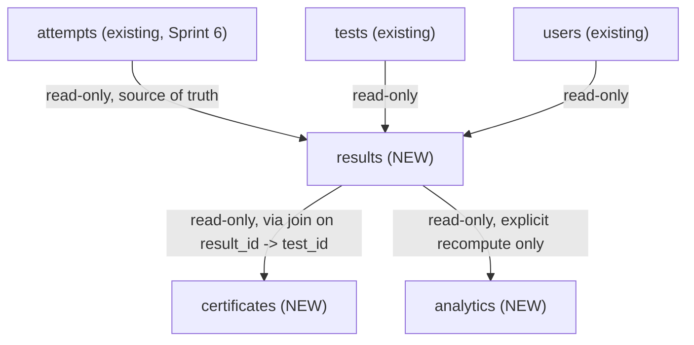
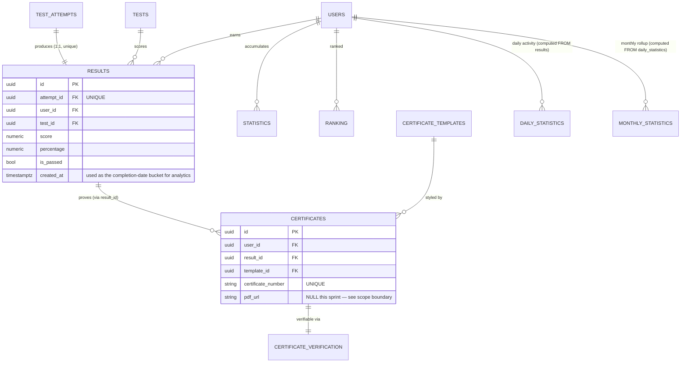

# Sprint 7 — Architecture Design: Results, Certificates, Analytics

**Status: DESIGN ONLY — no code written, no files modified.** Revision 2 — incorporates 4 approved decisions. Still awaiting final approval before implementation begins.

---

## Changelog from Revision 1

| Decision | What changed |
|---|---|
| 1. Analytics independent, no write from Results | Analytics redesigned entirely: no inbound write dependency; both `daily_statistics` and `monthly_statistics` are now populated by explicit, Admin-triggered recompute operations that **read `results` directly** (one-directional read, same pattern as every other cross-module dependency in the codebase — the exception flagged in Revision 1 no longer exists) |
| 2. Certificates idempotent per user+test | Idempotency key changed from "per `result_id`" to **"per `(user_id, test_id)`"** — since `certificates` has no direct `test_id` column, the check joins through `results.test_id` |
| 3. PDF generation out of scope | No longer listed as a "Risk" — it's a definite Sprint 7 scope boundary. `certificates.pdf_url` stays `NULL` this sprint; certificate issuance, validation, and templates are fully real, just without a rendered file yet |
| 4. Ranking tie-break rule | Documented in the `results` module's ranking section; **interpretation flagged above** — ranking computation stays in Sprint 7, "Leaderboards" as a polished feature is future |

---

## Sprint Goal

Turn a finished `test_attempts` row (Sprint 6 output) into a **persistent, queryable Result**, then build the two things that depend on it: **Certificates** (proof of passing, without file export yet) and **Analytics** (independent, on-demand aggregation from Results).

---

## Module Relationships



**Every cross-module dependency is now read-only**, no exceptions — `analytics → results` replaces the write-dependency flagged in Revision 1. This keeps the rule established since `topics → subjects` intact with zero exceptions across all of Sprint 5–7.

---

## Database Relationships

Unchanged from Revision 1 — all 10 tables already exist in `database/schema/schema_v2.sql` (Modules 16, 17, 20), already in baseline migration `0001`. **No new tables, no new migration.**



---

## Module A — `app/modules/results/`

### Purpose
Convert a finished `test_attempts` row into a permanent `Result`, maintain per-user/per-subject cumulative statistics, and compute leaderboard rankings with a deterministic tie-break order. **Badges and achievements are deferred** (see Future Extensions) — this sprint's `results` module owns `results`, `statistics`, and `ranking` only.

### Database tables
`results`, `statistics`, `ranking` (3 of the original 5 — `badges`/`achievements` deferred).

### API endpoints

| Method | Path | Purpose | Auth |
|---|---|---|---|
| POST | `/results` | Create a Result from a finished attempt (`{attempt_id}`) — idempotent on `attempt_id` | Authenticated (must own the attempt) |
| GET | `/results/me` | List my own results, paginated | Authenticated |
| GET | `/results/{id}` | Get one result | Authenticated (owner or Admin) |
| GET | `/results/ranking` | Leaderboard — `?subject_id=&period=` | Public |
| POST | `/results/ranking/recompute` | Recalculate ranks for a subject+period | Admin, Super Admin |

### Business rules
- Unchanged from Revision 1: one Result per attempt (idempotent), `is_passed` snapshotted at creation (never retroactively recomputed), statistics updated incrementally at Result-creation time.
- **Ranking tie-break order** (your decision 4), applied when sorting candidates for the same `(subject_id, period)`:
  1. **Higher `percentage`** (primary sort — this is "score" in the ranking table, which stores the ranking metric).
  2. **Shorter completion time** — `test_attempts.finish_time - test_attempts.start_time`, read via the existing `attempt_id` on `results` → `AttemptRepository` (already an approved read-only dependency; no new dependency introduced, just using two more fields — `start_time`/`finish_time` — from the same attempt row already being read for scoring).
  3. **Earlier `completed_at`** — `test_attempts.finish_time` itself, as the final tie-break if both score and duration are identical.
- `POST /results/ranking/recompute` reads every `Result` (+ its source `TestAttempt`, for duration) for the given `subject_id`/`period`, sorts by the three-level key above, assigns sequential `rank` values, upserts the `ranking` table. Admin-triggered, not automatic — same "no background worker" reasoning as Revision 1.

### Service flow — create a result (unchanged from Revision 1, minus the analytics call)

```
POST /results {attempt_id}
  → ResultService.create_result(attempt_id, user_id)
      → attempt_repo.get_by_id(attempt_id)        [read-only, existing]
      → ownership + finished-status checks
      → idempotent return-if-exists
      → test_repo.get_by_id(attempt.test_id)      [read-only, existing]
      → is_passed computed and snapshotted
      → create Result
      → statistics upserted (same module, no cross-module call)
      → commit
      → return Result
```
*(No `analytics_service.record_result(...)` call — removed per decision 1.)*

### Permissions
Unchanged from Revision 1.

### Required unit tests (revised estimate: ~24, down from 28 — badge tests removed, tie-break tests added)
Result creation (happy path, idempotent, rejects unfinished/wrong-owner, `is_passed` snapshot correctness), statistics arithmetic, **ranking tie-break — three dedicated tests**: same score/different duration, same score+duration/different completed_at, fully distinct scores (no tie-break needed, sanity check that the primary key alone suffices).

### Required integration tests (~4)
Full flow through ranking recompute; unchanged conceptually from Revision 1 minus the badge-award check.

---

## Module B — `app/modules/certificates/`

### Purpose
Issue a verifiable certificate record for a passed Result — **without generating an actual PDF file this sprint**. Full data model, issuance logic, validation, templates-as-data, and public verification are real; only the rendered document is deferred.

### Database tables
`certificate_templates`, `certificates`, `certificate_verification` (unchanged — 3 tables).

### API endpoints

| Method | Path | Purpose | Auth |
|---|---|---|---|
| POST | `/certificates` | Issue a certificate (`{result_id, template_id?}`) — idempotent per `(user_id, test_id)` | Authenticated (must own the result) |
| GET | `/certificates/me` | My certificates | Authenticated |
| GET | `/certificates/{id}` | Get one certificate | Authenticated (owner or Admin) |
| GET | `/certificates/verify/{code}` | Public verification by code — backend API only, no frontend page yet (see Future Extensions) | **Public, no auth** |
| GET | `/certificate-templates` | List templates | Public |
| POST | `/certificate-templates` | Create a template | Admin, Super Admin |

### Business rules
- Only issuable from a Result with `is_passed = true` (unchanged).
- **Idempotency key is now `(user_id, test_id)`, not `result_id`** (decision 2): before creating, the service checks whether *any* certificate already exists for this user having passed *this test* — via `certificates ⋈ results WHERE results.user_id = ? AND results.test_id = ?` — and returns that existing certificate instead of creating a new one. In practice, since Sprint 6's `attempts` module currently enforces `DEFAULT_MAX_ATTEMPTS = 1` platform-wide, a user can only ever have one Result per test today, so this is *currently* equivalent to keying on `result_id` — but the explicit `(user_id, test_id)` check is what's actually implemented, so it stays correct automatically if/when per-test `max_attempts > 1` is introduced later (a change already flagged as a Sprint 6 future improvement) without needing to revisit this module.
- **`pdf_url` is always `NULL` on creation this sprint** — not computed, not stubbed with a fake value, not silently defaulted to something misleading. The field exists (schema-defined) and is simply unpopulated, with the API response honestly reflecting that (`"pdf_url": null`), consistent with "never a silent fake implementation."
- `certificate_number`/`verification_code` generation, uniqueness, and the public verification counter/timestamp update — unchanged from Revision 1.

### Service flow — issue a certificate (revised idempotency check)

```
POST /certificates {result_id, template_id?}
  → CertificateService.issue(result_id, user_id, template_id)
      → result_repo.get_by_id(result_id)          [read-only, results module]
      → ownership check
      → result.is_passed must be true              [else 422]
      → existing = cert_repo.get_by_user_and_test(user_id, result.test_id)   [NEW query shape]
      → if existing: return existing                [idempotent per decision 2]
      → certificate_number, verification_code generated
      → create Certificate(pdf_url=None, status='issued')
      → create CertificateVerification row
      → commit
      → return Certificate (pdf_url: null)
```

### Required unit tests (revised estimate: ~13)
Unchanged core set from Revision 1, with the idempotency test rewritten to verify the `(user_id, test_id)` key specifically (e.g. two different `result_id`s that happen to share the same `test_id`+`user_id` — a scenario only reachable if `max_attempts` is later relaxed, but the test proves the query logic is correct now, ahead of that future change).

### Required integration tests (~3, unchanged)

---

## Module C — `app/modules/analytics/`

### Purpose — REDESIGNED per decision 1
Fully independent module. Computes `daily_statistics`/`monthly_statistics` **by reading `results` directly**, on explicit request — never triggered by, and never written to by, the `results` module.

### Database tables
`daily_statistics`, `monthly_statistics` (unchanged — 2 tables).

### API endpoints

| Method | Path | Purpose | Auth |
|---|---|---|---|
| GET | `/analytics/me/daily` | My daily activity — `?subject_id=&from=&to=` | Authenticated |
| GET | `/analytics/me/monthly` | My monthly rollup | Authenticated |
| GET | `/analytics/users/{id}/daily` | A specific user's daily activity | Admin, Super Admin |
| POST | `/analytics/recompute/daily` | Rebuild `daily_statistics` for a date range from `results` | Admin, Super Admin |
| POST | `/analytics/recompute/monthly` | Rebuild `monthly_statistics` for a month from `daily_statistics` | Admin, Super Admin |

### Business rules — REDESIGNED
- **`daily_statistics` is populated by `POST /analytics/recompute/daily {from, to}`**, not by a live trigger: reads every `Result` (via `ResultRepository`, read-only — the module's only dependency) whose `created_at` falls in `[from, to]`, groups by `(user_id, subject_id, date(created_at))`, upserts (delete-and-rebuild for that window, so re-running is always correct/idempotent — no double-counting).
- **`monthly_statistics` is populated by `POST /analytics/recompute/monthly {month, year}`**, aggregating from the module's own `daily_statistics` (unchanged from Revision 1 — this part never involved `results` module directly anyway).
- **"Scheduled analytics recalculation" is explicitly Future** (your list) — Sprint 7 ships the recompute *operations*, callable manually by an Admin (or, once Sprint 6's Alembic/infrastructure gains Celery, wired to a schedule with zero change to the service methods themselves — same "swap the trigger, not the logic" principle already used for `attempts`' lazy auto-finish).
- Date-range cap on `from`/`to` (max ~1 year) — unchanged from Revision 1, still a proactive performance guard.

### Service flow — recompute daily statistics

```
POST /analytics/recompute/daily {from, to}
  → AnalyticsService.recompute_daily(from, to)
      → results = result_repo.list_in_date_range(from, to)   [NEW read-only method, results module]
      → group by (user_id, subject_id, date(created_at))
      → for each group: delete existing daily_statistics row for that key (if any), insert fresh
      → commit
```

### Dependencies
`ResultRepository` (read-only) — the module's **only** external dependency. No inbound dependency from any other module (nothing calls into `analytics` except its own router).

### Required unit tests (~9, down from 10 — simpler, single-direction logic)
Recompute produces correct daily buckets from a set of results, re-running recompute for the same window doesn't double-count (delete-and-rebuild correctness), monthly rollup aggregates daily rows correctly, date range cap enforced.

### Required integration tests (~2, unchanged)

---

## Estimates (revised)

| | Revision 1 | Revision 2 |
|---|---|---|
| Migrations | 0 | 0 (unchanged) |
| Endpoints | ~21 | **16** (results: 5, certificates: 6, analytics: 5) |
| Unit tests | ~52 | **~46** (24 + 13 + 9) |
| Integration tests | ~11 | **~9** (4 + 3 + 2) |
| Files | ~40 | **~35** (fewer entities in `results`, `analytics` has one clean read dependency instead of a write) |

---

## Risks (revised)

| Risk | Severity | Notes |
|---|---|---|
| ~~PDF generation has no chosen implementation~~ | ~~High~~ | **Resolved — no longer a risk, it's an explicit scope decision (3).** Certificates ship fully functional except the file itself. |
| Ranking recompute cost grows with user count | Medium | Unchanged from Revision 1 — Admin-triggered, acceptable at current scale. |
| Analytics recompute (delete-and-rebuild per window) is O(results in range), run manually | Medium | Fine for Admin-triggered, infrequent use; would need incremental logic if it ever runs automatically/frequently — noted as a future optimization, not a Sprint 7 blocker. |
| **Interpretation risk**: "Leaderboards" listed as Future, but detailed tie-break rules given for ranking | Low, flagged | My working interpretation (stated at the top of this document) is that ranking *computation* stays in Sprint 7 and "Leaderboards" refers to a more complete future feature (e.g. a dedicated public leaderboard page/UI, multiple leaderboard types). **Please confirm or correct before implementation.** |
| Certificate idempotency logic depends on a join through `results` for every issuance check | Low | Cheap query (indexed columns), no real performance concern at this scale. |

---

## Future Extensions (as specified)

- **PDF export** — render `certificates.pdf_url` for real (library/service decision needed).
- **Email certificate delivery** — needs the `notifications` module (not yet built) to send the certificate (or a link to it) via email/SMS.
- **Public certificate verification page** — a frontend page consuming the already-built `GET /certificates/verify/{code}` backend endpoint; frontend work hasn't started platform-wide yet (per `.cursor/context/05-system-modules.md`).
- **Scheduled analytics recalculation** — wire `POST /analytics/recompute/*` to a Celery schedule once Celery exists, instead of manual Admin triggering.
- **Achievement badges** — `badges`/`achievements` tables (already in the schema, Module 16) — deferred entirely from Sprint 7's `results` module scope.
- **Leaderboards** — see the flagged interpretation risk above; whatever isn't covered by Sprint 7's basic `GET /results/ranking` endpoint.

---

## Definition of Done

- Same as Revision 1, with these adjustments:
  - No PDF-related deliverable required for "done" — `pdf_url: null` is the correct, complete state for Sprint 7.
  - `badges`/`achievements` are **not** part of Sprint 7's Definition of Done (deferred).
  - The interpretation risk (ranking vs. leaderboards) must be confirmed before or at the start of implementation, not discovered mid-sprint.
  - Certificate idempotency test suite must specifically cover the `(user_id, test_id)` key shape, not just `result_id`.

---

## Outstanding — confirm before implementation begins

1. **Interpretation check**: ranking computation (`results` module, with the specified tie-break order) stays in Sprint 7; "Leaderboards" as a future item refers to something beyond that (a polished/public leaderboard feature). Confirm or correct.
2. Everything else in this revision reflects your 4 decisions directly — no other open questions remain from Revision 1 (PDF, analytics independence, certificate idempotency, and tie-break order are all resolved).

No code will be written until you approve this revision.
