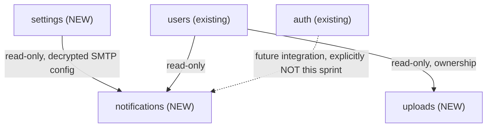

# Sprint 8 — Architecture Design: Notifications, Settings, Uploads

**Status: DESIGN ONLY — no code written, no repository files modified, no ZIP.**

## Architecture Freeze — compliance statement

Before the module-by-module design, confirming this document complies with every mandatory rule:

| Rule | Compliance |
|---|---|
| No new architectural layers | ✅ All three modules use the exact same layers every module since `auth` has used: `models, schemas, repository, service, router, dependencies, validators, exceptions, constants, tests/, README.md`. Encryption (Settings) and file storage (Uploads) are **capabilities inside the existing service layer**, not new layers — same relationship a repository has to Postgres, a "storage backend" has to the filesystem. Nothing sits between Router and Service, or between Service and Repository, that doesn't already exist elsewhere. |
| No parallel implementations | ✅ Each of the 12 tables gets exactly one model, one repository, one service — no `-v2`, no isolated builds. This is not a Sprint 3-style exploratory build. |
| No temporary or legacy code | ✅ Everything specified below is intended to ship as final, production code. Where something is explicitly out of this sprint's scope (e.g. real SMTP sending — see Risks), the design leaves it **absent**, not faked. |
| No change to approved architecture | ✅ Router → Service → Repository → Database, unchanged. Cross-module dependencies stay read-only and one-directional, same rule as every sprint since `topics → subjects`. |
| Work only inside existing module structure | ✅ Three new folders under `app/modules/`, nothing outside it except one small additive file in `app/core/security/` (see Settings — same precedent as adding `jwt_service.py` there in Sprint 4). |
| No placeholders / fake implementations | ✅ Flagged explicitly in Risks wherever a real external integration (SMTP, SMS, cloud storage) needs a decision before it can be "real" — the design never pretends these are solved. |
| No TODOs except documented future features | ✅ Every deferred item is written as a "Future Extensions" entry with a stated reason, not a bare `# TODO`. |

---

## Sprint Goal

Deliver the three remaining infrastructure modules — notification delivery, secure settings storage, and file uploads — using only the architecture already in place. No new patterns introduced.

---

## Module Relationships (with existing modules)



Only one new cross-module read dependency: `notifications → settings`. Same shape, same direction rule as every existing dependency (`topics → subjects`, `attempts → tests`, `analytics → results`) — read-only, one-directional, no exceptions.

`auth → notifications` is deliberately **not** built this sprint — wiring it would mean modifying `auth`'s already-stable `service.py`, out of scope unless separately requested.

---

## Module A — `app/modules/settings/`

### 1. Purpose
Store platform configuration, including encrypted-at-rest provider credentials (SMTP, payment, AI). The most security-sensitive module in the codebase.

### 2. Database tables
Reused entirely from the existing schema — **no new tables**: `general_settings`, `smtp_settings`, `payment_settings`, `ai_settings` (Module 22, `schema_v2.sql`, already in baseline migration `0001`).

### 3. Relationships with existing modules
None inbound. `notifications` will read this module's `SmtpSettingsRepository` (read-only) — that dependency is documented under Notifications, not here, since `settings` itself depends on nothing.

### 4. API endpoints

| Method | Path | Purpose | Auth |
|---|---|---|---|
| GET | `/settings/general` | List general settings | Admin, Super Admin |
| PUT | `/settings/general/{key}` | Upsert a setting | Super Admin |
| GET | `/settings/smtp` | Get SMTP config, secret field structurally absent | Super Admin |
| PUT | `/settings/smtp` | Set SMTP config, encrypts `password` | Super Admin |
| GET | `/settings/payment` | Get payment config, secret absent | Super Admin |
| PUT | `/settings/payment` | Set payment config, encrypts `secret_key` | Super Admin |
| GET | `/settings/ai` | Get AI config, secret absent | Super Admin |
| PUT | `/settings/ai` | Set AI config, encrypts `api_key` | Super Admin |

### 5. Business rules
- Secret fields are encrypted before every write, decrypted only for internal service-to-service use, **never returned by any GET endpoint** — the response schema (`SmtpSettingsOut` etc.) structurally has no field for the secret, not a nulled-out one.
- `payment_settings.provider` unique — one row per provider, per the existing `uq_payment_settings_provider` constraint.
- All writes are Super Admin only — stricter than every other module's Admin+SuperAdmin pattern, because these are infrastructure credentials, not content.

### 6. Validation rules
- `general_settings.key`: 1–150 chars, no leading/trailing whitespace.
- `smtp_settings.port`: 1–65535.
- Encrypted-field inputs: non-empty minimum length before encrypting.

### 7. Permissions / RBAC
Read general settings: Admin, Super Admin. Read/write provider credentials: Super Admin only, no exceptions — reusing the existing `require_roles("Super Admin")` dependency, unchanged.

### 8. Service flow
```
PUT /settings/smtp {host, port, username, password, from_email}
  → SmtpSettingsService.upsert(data, actor_id)
      → encrypted = EncryptionService.encrypt(data.password)
      → upsert smtp_settings(password=encrypted)
      → log_action('settings.smtp_updated')   [action only, never the secret]
      → commit → return SmtpSettingsOut   [no password field]
```

### 9. Dependencies
None on other business modules. One additive file: `app/core/security/encryption.py` (same precedent as `jwt_service.py`/`password_service.py` — shared infrastructure, not a new layer).

### 10. Required unit tests (~16)
Encrypt/decrypt round-trip correctness; encrypted value never equals plaintext; every GET response schema-verified to have no secret field; Super-Admin-only enforcement on every write; general-settings upsert (create and update paths); invalid port rejected; unique-provider constraint respected.

### 11. Required integration tests (~3)
Set SMTP config via API → read back → confirm no secret anywhere in the response → internal decrypt method returns the original value.

---

## Module B — `app/modules/uploads/`

### 1. Purpose
Accept, store, and track metadata for uploaded files (images, videos, documents).

### 2. Database tables
Reused entirely — **no new tables**: `uploads`, `images`, `videos`, `documents` (Module 23, already in baseline migration `0001`).

### 3. Relationships with existing modules
None. First module with zero cross-module repository reads — a genuinely standalone module, the simplest possible dependency graph.

### 4. API endpoints

| Method | Path | Purpose | Auth |
|---|---|---|---|
| POST | `/uploads` | Upload a file (multipart) | Authenticated |
| GET | `/uploads/{id}` | Get metadata | Authenticated (owner or Admin) |
| GET | `/uploads/{id}/download` | Serve the file | Authenticated — see Risks for the public-access question |
| DELETE | `/uploads/{id}` | Soft-delete metadata + remove the physical file | Authenticated (owner or Admin) |
| GET | `/uploads/me` | List my uploads, paginated | Authenticated |

### 5. Business rules
- File type/size validated **before** anything touches disk.
- `file_type` routes to exactly one metadata table: image → `images`, video → `videos`, document → `documents`.
- On-disk filename is a generated UUID, never derived from user-supplied `file_name` — closes path-traversal risk structurally, not by sanitization alone.
- Soft-delete also removes the physical file — a deliberate, stated exception to the platform's usual "nothing is really gone" soft-delete philosophy (storage isn't free the way a DB row is).

### 6. Validation rules
- Max file size per type — **needs your numbers**, see Risks.
- MIME-type allowlist, not a denylist.
- Display `file_name` sanitized (control characters stripped) even though it's never used as a storage path.

### 7. Permissions / RBAC
Own files: any authenticated user, ownership-checked (existing 404-not-403 pattern, same as `attempts`/`results`). Others' files: Admin, Super Admin.

### 8. Service flow
```
POST /uploads (multipart)
  → UploadService.upload(file, user_id)
      → validate content-type + size   [422 if rejected]
      → generated_name = uuid4() + extension
      → StorageBackend.save(generated_name, file.stream)
      → create Upload(file_name=original, file_url, file_type, size_bytes)
      → route to Image/Video/Document metadata row based on file_type
      → log_action('upload.created') → commit → return UploadOut
```

### 9. Dependencies
None on other business modules. One new infrastructure abstraction, `StorageBackend` (local-disk implementation this sprint) — lives inside the module (`app/modules/uploads/storage.py`), used only by this module's service, not a shared/new architectural layer.

### 10. Required unit tests (~18)
Rejects disallowed MIME type; rejects oversized file; storage name is always UUID-based regardless of input `file_name` (including a path-traversal-attempt input); correctly routes to image/video/document metadata; ownership checks; soft-delete calls the storage backend's delete (mocked).

### 11. Required integration tests (~4)
Full upload → retrieve → download against a real temp-directory filesystem; delete removes both DB visibility and the physical file.

---

## Module C — `app/modules/notifications/`

### 1. Purpose
In-app notifications plus reliable outbound email/SMS via queue tables with retry tracking.

### 2. Database tables
Reused entirely — **no new tables**: `notification_templates`, `notifications`, `email_queue`, `sms_queue` (Module 19, already in baseline migration `0001`).

### 3. Relationships with existing modules
Reads `settings` (SMTP config, read-only, decrypted internally). Reads `users` (read-only, ownership). Reuses `auth.validators.validate_uzbek_phone` — a pure function import, not a repository dependency, so it introduces no coupling beyond what already exists platform-wide (every module already imports pure validators freely; only repository/service reads count as the tracked "module dependency").

### 4. API endpoints

| Method | Path | Purpose | Auth |
|---|---|---|---|
| GET | `/notifications/me` | List my notifications, `?is_read=` | Authenticated |
| PATCH | `/notifications/{id}/read` | Mark one read | Authenticated (owner) |
| PATCH | `/notifications/me/read-all` | Mark all mine read | Authenticated |
| POST | `/notifications` | Create an in-app notification for a user | Admin, Super Admin |
| GET | `/notifications/templates` | List templates | Admin, Super Admin |
| POST | `/notifications/templates` | Create a template | Admin, Super Admin |
| POST | `/notifications/queue/email` | Enqueue an email | Admin, Super Admin |
| POST | `/notifications/queue/sms` | Enqueue an SMS | Admin, Super Admin |
| POST | `/notifications/queue/process` | Delivery engine trigger | Admin, Super Admin |

### 5. Business rules
- Enqueueing always succeeds instantly (`INSERT ... status='pending'`); delivery is a separate, explicit trigger (`POST /queue/process`) — same engine-trigger pattern already established by `results/ranking/recompute` and `analytics/recompute/*`, not a new pattern.
- `queue/process` reads decrypted SMTP config from `settings`, attempts delivery for pending rows up to a batch size, updates `sent`/`failed`, increments `attempts`; a row past a max-attempts threshold stops retrying.
- In-app notifications never touch the queue tables — a direct `notifications` row, no delivery step.
- **Whether the send step calls a real SMTP/SMS provider this sprint, or the queue/retry/trigger machinery ships without a real network call yet, is flagged in Risks** — not assumed either way.

### 6. Validation rules
- `channel` restricted to `in_app | email | sms`.
- `to_email` syntactically validated; `to_phone` validated via the reused `validate_uzbek_phone` pure function.
- `notification_templates.code` unique (schema-enforced), `channel` restricted to the same three values.

### 7. Permissions / RBAC
Own notifications (read/mark-read): any authenticated user, ownership-checked. Everything else: Admin, Super Admin — reusing `require_roles`, unchanged.

### 8. Service flow
```
POST /notifications/queue/process
  → NotificationService.process_email_queue(batch_size)
      → smtp_config = settings_repo.get_decrypted_smtp()   [read-only]
      → pending = email_queue_repo.list_pending(batch_size)
      → for each: attempt send → sent/failed, attempts tracked
      → commit → return {processed, sent, failed}
```

### 9. Dependencies
`settings` (read-only, decrypted config). `auth.validators` (pure function reuse only).

### 10. Required unit tests (~20)
Mark-as-read ownership; filter by `is_read`; enqueue is not idempotent by design (each call is a new send, unlike `results`/`certificates`'s idempotent-create — tested to confirm this is intentional, not a bug); `MAX_ATTEMPTS` respected; template code uniqueness; phone/email format validation.

### 11. Required integration tests (~5)
Enqueue → process → status transitions; one failing row in a batch doesn't stop the rest.

---

## Estimates

| | Estimate |
|---|---|
| Migrations | **0** — all 12 tables already exist in baseline `0001`. (Encryption needs a new `.env` variable, not a migration.) |
| Endpoints | **23** (settings 8, uploads 5, notifications 9 — settings recounted: general×2 + smtp×2 + payment×2 + ai×2 = 8) |
| Unit tests | **54** (16 + 18 + 20) |
| Integration tests | **12** (3 + 4 + 5) |

---

## Risks

| Risk | Severity |
|---|---|
| Encryption key management — where the key encrypting secrets lives; if lost, encrypted rows are permanently unreadable | High |
| Real SMTP/SMS provider integration unscoped — needs a decision, same shape as Sprint 7's PDF deferral | High |
| File storage is local-disk only this sprint — fine for the current single-server `docker-compose.yml`, real work needed to move to cloud storage later (the `StorageBackend` abstraction exists specifically so that move doesn't touch `UploadService`) | Medium |
| Video duration / document page-count extraction need new parsing dependencies not yet in `requirements.txt` — recommend leaving `NULL` this sprint | Medium |
| `/uploads/{id}/download` public-vs-authenticated is unresolved | Medium |
| Deleting the physical file on soft-delete is a stated exception to the usual soft-delete convention | Low |

---

## Definition of Done

- Same 8-layer pattern, `py_compile`, 0 circular imports, full Swagger, README/CHANGELOG updated — unchanged baseline.
- Encryption key source resolved and documented in `backend/.env.example` before "done."
- Every settings GET response schema-verified (dedicated test) to have no secret field.
- `UploadService` never calls filesystem functions directly — always through `StorageBackend`.
- All "Decisions needed" below resolved before implementation starts.

---

## Project Impact Analysis

**Does Sprint 8 introduce any architectural changes?**
No. Router → Service → Repository → Database is unchanged. Every new capability (encryption, file storage, outbound email/SMS) is implemented as infrastructure used *by* the existing service layer — the same relationship a repository already has to Postgres — not as a new layer sitting between existing ones.

**Does it increase coupling between modules?**
Minimally, and in the same direction/shape as every prior sprint. One new read dependency: `notifications → settings`. `uploads` has *zero* module dependencies — the least coupled module in the codebase. No module gains a new write dependency from another (the one write-dependency exception ever considered, in Sprint 7's Analytics design, was rejected in favor of read-only — that precedent holds here too).

**Can every module work independently?**
`settings`: yes, fully standalone. `uploads`: yes, fully standalone (zero dependencies). `notifications`: depends on `settings` only for the *delivery* step (`queue/process`) — in-app notifications, enqueueing, templates, and read/mark-read all work with zero dependency on `settings` or any other module.

**Are there any future extension points?**
Yes, each module has at least one, all listed as "Future Extensions" rather than half-built: `auth → notifications` wiring (replaces the Sprint 1 debug-code TODO); cloud storage backend swap-in for `uploads` (the abstraction exists now specifically to make this a later, isolated change); real SMTP/SMS provider selection for `notifications`; video/document metadata extraction once a parsing library is chosen.

**Are there any risks of technical debt?**
The two flagged "High" risks (encryption key management, real provider integration) are the only places this sprint could accumulate debt if rushed — both are called out explicitly rather than silently deferred, consistent with every prior sprint's practice of naming a gap instead of hiding it. Everything else in this design closes existing debt (the Sprint 1 notifications TODO, the schema's long-standing "encrypted at rest" comment that was never implemented) rather than creating new debt.

---

## Decisions needed from you before code starts

1. Encryption approach: `cryptography` library (Fernet), key from a new `.env` variable — approve as the standard choice?
2. Real SMTP/SMS sending this sprint, or queue-and-trigger machinery only (defer real sending, same pattern as Sprint 7's PDF deferral)?
3. `/uploads/{id}/download`: authenticated-only, or public for certain upload types?
4. File size limits per type — concrete numbers needed.
5. Confirm: skip `video.duration_seconds`/`document.page_count` extraction this sprint (leave `NULL`)?
