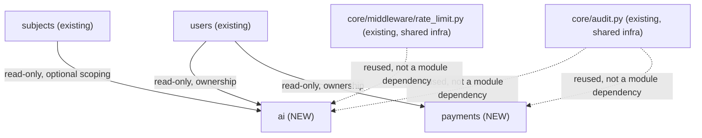

# Sprint 9 — Architecture Design: AI, Payments

**Status: DESIGN ONLY — no code written, no repository files modified, no ZIP.**

## Architecture Freeze — compliance statement

| Rule | Compliance |
|---|---|
| No new architectural layers | ✅ Same 8-layer pattern throughout. Provider abstractions (`AIProvider`, `PaymentProvider`) live **inside each module** (`app/modules/ai/providers.py`, `app/modules/payments/providers.py`) — identical precedent to Sprint 8's `notifications/providers.py` and `uploads/storage.py`. Infrastructure the service depends on, not a new layer between Router/Service/Repository. |
| No parallel implementations | ✅ One model, one repository, one service per entity. No `-v2`. |
| No temporary or legacy code | ✅ Everything specified is final, production code. Vendor integrations are absent (not faked) where explicitly out of scope — same honest pattern as Sprint 8's `UnconfiguredEmailProvider`. |
| Existing architecture exactly | ✅ Router → Service → Repository → Database, unchanged. Cross-module dependencies stay read-only, one-directional. |
| Work only inside approved module structure | ✅ Two new folders under `app/modules/`. AI's rate limiting reuses the existing `core/middleware/rate_limit.py` (Sprint 1) — no new middleware. AI's usage logging reuses the existing `core/audit.py` `log_action()` — no new logging mechanism. |
| No placeholders / fake implementations | ✅ `UnconfiguredAIProvider`/`UnconfiguredPaymentProvider` honestly raise rather than pretend to call a real vendor — same pattern proven in Sprint 8. |
| No TODOs except documented future features | ✅ Every deferred item is a "Future Extensions" entry with a stated reason. |

**No vendor-specific code anywhere in this design** — no OpenAI/Anthropic/Gemini import, no Payme/Click/Stripe SDK import. Both modules are 100% provider-agnostic by construction, per your explicit requirement.

---

## Sprint Goal

Build the two remaining backend modules from the original 25-module plan as **provider-agnostic frameworks**: a pluggable AI layer (conversation history, usage logging, rate-limiting hooks) and a pluggable payments layer (transaction lifecycle, webhook architecture, refunds, idempotency) — neither one wired to any specific vendor.

---

## Module Relationships (with existing modules)



**`ai` and `payments` have zero dependency on each other.** Both depend only on `users` (read-only, ownership checks) and shared `core/` infrastructure (audit logging, rate limiting) that every module already uses — not a new coupling, the same infrastructure `auth` has used since Sprint 1.

---

## Module A — `app/modules/ai/`

### 1. Purpose
Provider-agnostic AI chat framework: conversation history, recommendations, study plans, usage tracking, rate-limiting — with zero dependency on any specific AI vendor.

### 2. Database tables
Reused entirely — **no new tables**: `ai_chats`, `ai_history`, `ai_recommendations`, `study_plans` (Module 21, `schema_v2.sql`, already in baseline migration `0001`).

**Usage logging reuses the existing `audit_logs` table** (via `core.audit.log_action()`) rather than a new table — `metadata` (JSONB) carries `{provider, model, tokens_used, conversation_id}`. This satisfies "usage logging" with zero new schema, consistent with "reuse existing schema whenever possible."

### 3. Relationships with existing modules
Reads `users` (read-only, ownership). Optionally reads `subjects` (read-only) when a recommendation/study plan is scoped to a subject — same pattern `tests`/`topics` already use for optional subject scoping. Reuses `core/audit.py` and `core/middleware/rate_limit.py` — shared infrastructure, not a module dependency (no other business module is imported).

### 4. API endpoints

| Method | Path | Purpose | Auth |
|---|---|---|---|
| POST | `/ai/chats` | Start a new conversation | Authenticated |
| GET | `/ai/chats/me` | List my conversations | Authenticated |
| GET | `/ai/chats/{id}` | Get a conversation + its history | Authenticated (owner) |
| POST | `/ai/chats/{id}/messages` | Send a message, get a response | Authenticated (owner), rate-limited |
| GET | `/ai/recommendations/me` | My AI-generated recommendations | Authenticated |
| GET | `/ai/study-plans/me` | My study plans | Authenticated |
| POST | `/ai/study-plans` | Create a study plan | Authenticated |

### 5. Business rules
- **`POST /ai/chats/{id}/messages` is the only endpoint that calls `AIProvider`** — every other endpoint is plain CRUD over `ai_chats`/`ai_history`/etc.
- **Rate-limited via the existing `core/middleware/rate_limit.py` dependency** (Redis fixed-window, already used by `auth`'s `/register`/`/login`/`/verify`) — a new rate-limit *bucket* for this endpoint, not a new rate-limiting *mechanism*. This is the "rate limiting hooks" requirement satisfied by reuse, not a new system.
- **Every AI call is usage-logged** via `log_action(action="ai.message_sent", metadata={provider, tokens_used, conversation_id})` — logged even when the provider call fails (a failed/refused call is still usage-relevant: it tells you rate limits or configuration gaps are being hit).
- **`AIRequest`/`AIResponse` are the module's stable internal contract** — `AIProvider.generate(request: AIRequest) -> AIResponse`. Every future vendor plugin implements this exact interface; `AIService` never changes when a new provider is added, only `get_ai_provider()` (the dependency function) changes — identical mechanism to Sprint 8's `get_email_provider()`.
- **Conversation history is passed to the provider as context** — `AIRequest.history: list[AIMessage]`, built from `ai_history` rows for that `chat_id`, so a real future provider can maintain multi-turn context without `AIService` needing to know how any specific vendor's API represents "conversation."

### 6. Validation rules
- Message content: non-empty, capped at a maximum length (prevents an enormous prompt from being sent to a not-yet-existing provider's future token-cost billing).
- `study_plans.start_date <= end_date` (schema has both as `DATE NOT NULL`, no DB-level check constraint — validated at the service layer, same reasoning as similar date-range validations in `analytics`).

### 7. Permissions / RBAC
Own chats/recommendations/study-plans: any authenticated user, ownership-checked (404-not-403 pattern, unchanged). No Admin-tier endpoints this sprint (no AI content-moderation/admin-override feature requested).

### 8. Service flow — send a message

```
POST /ai/chats/{id}/messages {content}
  → rate_limit dependency check   [existing core/middleware, reused]
  → AIService.send_message(chat_id, content, user_id)
      → ownership check on chat_id
      → history = ai_history_repo.list_for_chat(chat_id)   [existing rows, own repository]
      → request = AIRequest(prompt=content, history=history)
      → response = AIProvider.generate(request)
          → UnconfiguredAIProvider raises AIProviderNotConfiguredException  [this sprint]
      → on success: persist both the user message and the AI response as ai_history rows
      → log_action('ai.message_sent', metadata={...})   [always, success or failure]
      → commit → return AIResponse
```

### 9. Dependencies
`users` (read-only, ownership). Optionally `subjects` (read-only). `core/audit.py`, `core/middleware/rate_limit.py` (shared infrastructure, reused).

### 10. Required unit tests (~18)
Ownership checks on chat/history access; rate-limit dependency is applied to the message-send endpoint (verified via dependency inspection, not a live Redis call); `AIProvider.generate()` honestly raises via `UnconfiguredAIProvider` (mirrors Sprint 8's provider tests exactly); usage is logged on both success and provider-not-configured paths; conversation history is correctly assembled and passed to `AIRequest`; study plan date-range validation.

### 11. Required integration tests (~4)
Full flow: start chat → send message (501, provider not configured) → usage log recorded regardless; study plan creation end-to-end.

---

## Module B — `app/modules/payments/`

### 1. Purpose
Provider-agnostic payment framework: plans, subscriptions, transaction lifecycle, webhook handling, refunds, idempotency — with zero dependency on any specific payment gateway.

### 2. Database tables
Reused entirely — **no new tables** for the core flow: `plans`, `subscriptions`, `payments`, `transactions` (Module 18, `schema_v2.sql`, already in baseline migration `0001`).

**⚠️ One real schema gap, flagged (see Outstanding Decisions #3)**: `transactions.provider_txn_id` has **no `UNIQUE` constraint** in the schema. Idempotency (an explicit requirement) is achievable at the **service layer** this sprint (check-then-insert), but not database-enforced. A migration adding the constraint is the stronger, recommended fix — not applied without your approval, since it changes the schema.

### 3. Relationships with existing modules
Reads `users` (read-only, ownership). No dependency on `subscriptions`-adjacent modules like `tests`/`certificates` this sprint — a subscription *granting* access to premium content is a real future integration point (see Future Extensions), not built now.

### 4. API endpoints

| Method | Path | Purpose | Auth |
|---|---|---|---|
| GET | `/payments/plans` | List active subscription plans | Public |
| POST | `/payments/plans` | Create a plan | Admin, Super Admin |
| POST | `/payments/subscriptions` | Subscribe to a plan | Authenticated |
| GET | `/payments/subscriptions/me` | My subscriptions | Authenticated |
| POST | `/payments/initiate` | Start a payment (calls `PaymentProvider.initiate()`) | Authenticated |
| GET | `/payments/me` | My payment history | Authenticated |
| GET | `/payments/{id}` | Get one payment + its transactions | Authenticated (owner or Admin) |
| POST | `/payments/webhook/{provider}` | Provider callback endpoint | **Public, no auth** — verified by provider signature, not a Bearer token |
| POST | `/payments/{id}/refund` | Refund a payment | Admin, Super Admin |

### 5. Business rules
- **`POST /payments/initiate` is the only endpoint that calls `PaymentProvider.initiate()`** — creates a `payments` row (`status='pending'`) first, then asks the provider to start the flow (would return a redirect URL for a real provider; `UnconfiguredPaymentProvider` raises honestly this sprint).
- **Webhook endpoint is provider-agnostic at the routing level, provider-specific at the verification level**: `POST /payments/webhook/{provider}` dispatches to the matching `PaymentProvider.verify_webhook(raw_payload, headers)` — signature verification is each provider's own responsibility (different providers sign differently), never done generically. `UnconfiguredPaymentProvider.verify_webhook()` raises honestly.
- **Idempotency, this sprint (service-layer)**: before recording a webhook-reported transaction, `TransactionRepository.get_by_provider_txn_id()` checks for an existing row; if found, the webhook is acknowledged (200 OK, required by virtually every payment provider's retry contract) **without creating a duplicate or double-crediting a subscription**. Tested explicitly.
- **Refunds don't need a new table** — a refund is recorded as a new `transactions` row (`status='refund_recorded'`, `raw_response` capturing the provider's refund response) linked to the original `payment_id`, with the parent `payments.status` updated to `'refunded'` (already a valid `payment_status` enum value). `PaymentProvider.refund()` is the vendor-specific call; `UnconfiguredPaymentProvider` raises honestly.
- **Every state transition is audit-logged**: `payment.initiated`, `payment.webhook_received`, `payment.refunded` — via the existing `log_action()`, never a new logging mechanism.
- **`transactions.raw_response` stores the verbatim provider payload** (JSONB) for every event — the audit trail for "what did the provider actually say," independent of `core/audit.py`'s action log (which records *that* something happened, not the raw external payload).

### 6. Validation rules
- `amount > 0`, `currency` restricted to a small allowlist (start with `UZS`, matching the schema's default).
- `plans.duration_days > 0`.
- Refund amount (if partial refunds are ever supported) must not exceed the original payment amount — **full refunds only this sprint** (see Outstanding Decisions #4) simplifies this to "the whole amount, once."

### 7. Permissions / RBAC
Own subscriptions/payments: any authenticated user, ownership-checked. Plan management, refunds: Admin, Super Admin. Webhook endpoint: **no user auth** (it's not a user calling it) — trust comes entirely from provider signature verification inside `PaymentProvider.verify_webhook()`, which is why an honestly-unconfigured provider is the *safe* default (it refuses everything, rather than accepting unverified webhooks).

### 8. Service flow — webhook received

```
POST /payments/webhook/{provider} (raw body + headers)
  → PaymentWebhookService.handle(provider_name, raw_body, headers)
      → provider = provider_registry.get(provider_name)   [dispatch by name]
      → result = provider.verify_webhook(raw_body, headers)
          → UnconfiguredPaymentProvider raises honestly   [this sprint — no real provider registered]
      → (if verified, future sprint): txn_repo.get_by_provider_txn_id(result.txn_id)
          → if exists: return 200 OK, no duplicate processing   [idempotency]
          → else: create Transaction, update Payment.status, log_action('payment.webhook_received')
```

### 9. Dependencies
`users` (read-only, ownership). `core/audit.py` (reused, not a module dependency).

### 10. Required unit tests (~22)
Plan creation/listing; subscription creation; payment initiation creates a `pending` row before calling the provider; `PaymentProvider.initiate()`/`verify_webhook()`/`refund()` all honestly raise via `UnconfiguredPaymentProvider` (mirrors Sprint 8's provider tests); webhook idempotency — processing the same `provider_txn_id` twice does not create a duplicate transaction or double-refund/double-credit (the single most important test in this module); refund creates a `transactions` row and updates `payments.status`; amount/currency validation.

### 11. Required integration tests (~5)
Full flow: create plan → subscribe → initiate payment (501, provider not configured) → audit trail confirms `payment.initiated` was logged regardless; webhook idempotency proven against a real (test) DB with two identical webhook calls.

---

## Estimates

| | Estimate |
|---|---|
| Migrations | **0**, if service-layer idempotency is accepted (see Outstanding Decisions #3). **1**, if you want the `transactions.provider_txn_id` `UNIQUE` constraint added at the DB level. |
| Endpoints | **16** (AI: 7, Payments: 9) |
| Unit tests | **40** (AI 18, Payments 22) |
| Integration tests | **9** (4 + 5) |
| Files | ~30 (≈15 per module — each has a `providers.py`, same as Sprint 8's two modules) |

---

## Risks

| Risk | Severity |
|---|---|
| **No real AI or payment vendor is wired in** — by design (your explicit requirement), but stated as a risk because "AI module" and "Payments module" sound complete to a non-technical stakeholder; they are complete **frameworks**, not complete **integrations**. Flagging so this isn't discovered as a surprise later. | High (expectation-management, not a technical risk) |
| **`transactions.provider_txn_id` has no DB-level uniqueness** — service-layer idempotency is real and testable, but a race condition (two webhook deliveries processed concurrently) could theoretically slip past a check-then-insert without a DB constraint. Real payment providers do sometimes double-deliver webhooks. | Medium |
| **Refunds are full-only this sprint** — partial refunds need amount-tracking logic not built now (see Outstanding Decisions #4). | Low |
| **AI conversation cost/token budgeting is not implemented** — usage is *logged*, not *limited* by cost (only by request-rate, via the reused rate limiter). A real provider integration would need a separate spend-cap design later. | Low |

---

## Definition of Done

- Same 8-layer pattern, `py_compile`, 0 circular imports, full Swagger, README/CHANGELOG updates — unchanged baseline from every prior sprint.
- `AIProvider`/`PaymentProvider` interfaces fully defined; `Unconfigured*` implementations honestly raise, proven by dedicated tests (same standard Sprint 8 set).
- Webhook idempotency proven by a dedicated test simulating duplicate delivery.
- Every "Outstanding Decision" below resolved before implementation starts.
- No import of any vendor SDK (`openai`, `anthropic`, `stripe`, etc.) anywhere in the codebase — verified by a grep-based check as part of validation, same rigor as the "no vendor code" requirement.

---

## Project Impact Analysis

**Does Sprint 9 introduce architectural changes?**
No. Same Router → Service → Repository → Database. Provider abstractions live inside each module, same relationship `StorageBackend`/`EmailProvider` already established in Sprint 8 — not a new layer.

**Does it increase coupling between modules?**
No new business-module coupling. Both `ai` and `payments` depend only on `users` (read-only, ownership) and shared `core/` infrastructure every module already uses. Neither depends on the other.

**Are AI and Payments independent?**
Yes, completely — zero shared tables, zero shared repositories, zero import of one module from the other. They could be built, tested, and deployed in either order, or by two different people in parallel, with no coordination needed beyond both reading `users`.

**Future extension points?**
AI: real vendor plugins (OpenAI/Anthropic/Gemini implementations of `AIProvider`), token-cost budgeting, `subjects`-scoped recommendation tuning. Payments: real vendor plugins (Payme/Click/Stripe implementations of `PaymentProvider`), a `subscriptions → tests/certificates` access-gating integration (premium content), partial refunds, DB-level idempotency constraint.

**Are there any risks of technical debt?**
The "High" risk above (frameworks vs. integrations) is an expectation-debt risk, not a code-quality one — mitigated entirely by stating it plainly now. The "Medium" idempotency risk is real technical debt if left unresolved indefinitely, which is exactly why it's listed as an explicit Outstanding Decision rather than silently accepted.

---

## Outstanding Decisions — must be resolved before implementation

1. **AI rate-limit specifics**: what request/window should `POST /ai/chats/{id}/messages` use (e.g. 10 requests/minute per user)? The mechanism (reuse `core/middleware/rate_limit.py`) is decided; the numeric limit is a product decision, not assumed here.
2. **AI message length cap**: a concrete character/token limit is needed for validation — not assumed.
3. **Payments idempotency**: accept service-layer idempotency (0 migrations), or add a `UNIQUE` constraint on `transactions.provider_txn_id` (1 migration, stronger guarantee)?
4. **Refunds**: full-refund-only this sprint (simpler), or partial refunds with amount-tracking (more complex, needs additional validation logic)?
5. **Webhook endpoint path/naming**: `POST /payments/webhook/{provider}` assumes `{provider}` is a path segment matching the `payment_provider` enum values (`click`, `payme`, etc.) — confirm this is the desired routing shape versus, e.g., one endpoint per provider.
6. **Subscription-to-access integration**: explicitly out of scope this sprint (a subscription doesn't yet unlock anything) — confirm this is acceptable, since "Payments" without any content-gating effect is a framework, not a feature a user would notice yet.
